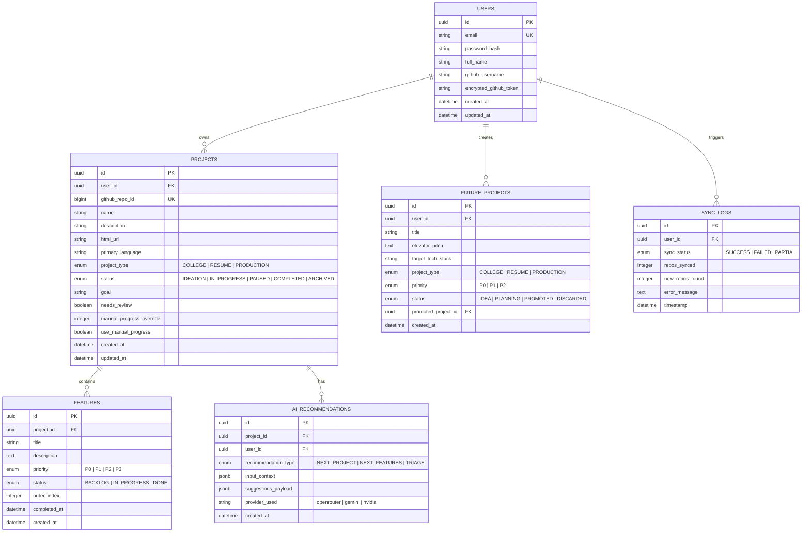

# Product Requirements Document (PRD)

## Project: Personal Project Manager (DevCommand)
**Version:** 1.0.0  
**Author:** AI Pair Architect & User  
**Status:** Approved & Ready for Implementation  
**Last Updated:** October 2026  

---

## 1. Executive Summary & Intent

### 1.1 Problem Statement
Developers frequently create and abandon GitHub repositories, store project ideas across disjointed note apps, and struggle to maintain momentum on existing work. There is no unified system that:
1. Automatically tracks GitHub repositories as soon as they are created.
2. Organizes projects by practical purpose (College Assignment, Resume-Level Portfolio, Production-Ready SaaS).
3. Connects high-level project goals to concrete, prioritized feature backlogs.
4. Intelligently suggests both *what features to build next on an existing project* and *what new project to build next* based on past work.
5. Provides an ergonomic experience across both **Android mobile** (for on-the-go capture, updates, and reviews) and **Desktop Web** (for deep work and management).

### 1.2 Product Vision
A personalized, cross-platform Project Command Center that connects directly to GitHub. It automatically populates new repositories, uses an intelligent multi-tiered AI cascade (OpenRouter &rarr; Gemini &rarr; NVIDIA) to triage and propose next steps, tracks progress via prioritized feature checklists, and manages a prioritized queue of future ideas that seamlessly graduate into active projects.

---

## 2. Target Users & Personas

- **Primary Persona (Solo Developer / Student / Indie Hacker):**
  - Creates 5–30 repos a year across experimental code, university assignments, and production apps.
  - Wants zero-friction repository tracking (no manual entry of repo details).
  - Uses phone during transit/breaks to review tasks and log ideas, and PC during development.
  - Wants AI that acts like a senior mentor suggesting high-impact features aligned with project goals.
- **Secondary (Multi-Tenant Capability):**
  - Architecture supports multi-user data isolation (User A cannot see User B's projects or tokens).

---

## 3. High-Level Architecture & Monorepo Structure

```
Project-manager/
├── backend/                  # Python FastAPI Backend API
│   ├── app/
│   │   ├── api/              # REST Endpoints (auth, projects, github, ai, features)
│   │   ├── core/             # Config, security, database session, logging
│   │   ├── models/           # SQLModel / SQLAlchemy ORM Schemas
│   │   ├── schemas/          # Pydantic Request/Response DTOs
│   │   ├── services/         # GitHub API, AI Cascade Service, Sync Engine
│   │   └── main.py           # Application Entrypoint
│   ├── tests/                # Pytest Test Suite
│   ├── Dockerfile            # Container configuration
│   ├── requirements.txt      # Python dependencies
│   └── alembic/              # Database Migrations
├── web/                      # Next.js 14+ (App Router) Web Frontend
│   ├── src/
│   │   ├── app/              # Routes: /dashboard, /projects, /ideas, /settings
│   │   ├── components/       # UI Components (Kanban, Tables, AI Drawers)
│   │   ├── lib/              # API Client (Axios/Ky), Auth Context, Zustand Store
│   │   └── types/            # TypeScript Interface Definitions
│   ├── package.json
│   └── tailwind.config.ts
├── mobile/                   # Flutter Android Application
│   ├── lib/
│   │   ├── core/             # Theme, HTTP Client, Secure Storage, Routes
│   │   ├── models/           # Dart Data Models
│   │   ├── providers/        # State Management (Riverpod / Provider)
│   │   ├── screens/          # Dashboard, Project Details, Future Ideas, AI Chat
│   │   └── widgets/          # Priority Chips, Feature Checklists, Progress Rings
│   └── pubspec.yaml
├── docs/                     # Architecture, API Contracts, Deployment Guides
├── docker-compose.yml        # Local fullstack development compose file
├── PRD.md                    # This document
└── EXECUTION_PLAN.md         # Phased Implementation Tasks
```

---

## 4. Detailed Feature Specifications

### Feature 1: Authentication & User Accounts
- **Capabilities:**
  - Standard Email + Password registration and login with bcrypt hashing.
  - GitHub OAuth 2.0 Login / Linking (`/api/auth/github/login` & `/api/auth/github/callback`).
  - JWT Access Token (short-lived, 60 mins) + Refresh Token (long-lived, 30 days) stored securely in `flutter_secure_storage` on mobile and `httpOnly` secure cookies on web.
  - Complete user isolation: All projects, GitHub tokens, and feature lists are strictly keyed by `user_id`.

### Feature 2: GitHub Repository Ingestion & Synchronization Engine
- **Capabilities:**
  - **Connection:** User stores a GitHub Personal Access Token (PAT) with `repo` read scope (or links via GitHub OAuth). Tokens are AES-256 encrypted at rest in the database.
  - **Automatic Ingestion:** Background polling cron runs every 30 minutes to check `/user/repos?sort=created&direction=desc`.
  - **On-Demand Sync:** Instant "Sync Now" button on both Web and Mobile dashboards triggers immediate repo ingestion.
  - **Deduplication:** Matching on `github_repo_id` prevents duplicate project entries.
  - **Metadata Captured:** Repository name, description, default branch, primary language, stars, forks, visibility (public/private), GitHub HTML URL, and `README.md` content (for AI triage).

### Feature 3: Project Classification & Onboarding Queue ("Needs Review")
- **Capabilities:**
  - When a new repo is detected, it is placed into a **Needs Review** queue.
  - **Project Types:**
    - `College Project` (Focused on academic deadlines, syllabus requirements, documentation).
    - `Resume Project` (Focused on portfolio presentation, clean architecture, live demo, metrics).
    - `Production Ready` (Focused on scalability, security, CI/CD, monitoring, payment/auth).
  - **Project Statuses:** `Ideation`, `In Progress`, `Paused`, `Completed`, `Archived`.
  - **AI Auto-Triage:** On ingestion, AI analyzes the repo name, description, and README to propose:
    - Likely Project Type
    - Suggested Primary Goal (e.g., *"Build a responsive micro-SaaS with Stripe billing and 99.9% uptime"*)
    - Initial target features
  - User can confirm with 1 click or quickly adjust fields in a modal/bottom-sheet.

### Feature 4: Prioritized Feature Backlogs & Progress Tracking
- **Capabilities:**
  - Each project contains a dedicated **Feature Addition List**.
  - **Attributes per Feature:**
    - `Title` (string)
    - `Description` (markdown/text)
    - `Priority`: `P0 - Critical / MVP Blocker`, `P1 - High`, `P2 - Medium`, `P3 - Nice to have`
    - `Status`: `Backlog`, `In Progress`, `Done`
    - `Target Release / Milestone`
  - **Progress Calculation Algorithm:**
    - Progress % is calculated dynamically using priority-weighted formula:
      $$\text{Progress} = \frac{\sum (\text{Weight} \times \text{Done Features})}{\sum (\text{Weight} \times \text{Total Features})} \times 100$$
      *(Weights: P0 = 4, P1 = 3, P2 = 2, P3 = 1)*
    - Supports manual override percentage toggle if user wants custom tracking.
    - Displays visual progress ring / bar on project cards and detail views.

### Feature 5: Future Project Priority List (Idea Incubator)
- **Capabilities:**
  - Dedicated screen/section for ideas not yet started.
  - **Fields:** Title, elevator pitch, target project type, anticipated tech stack, priority (`P0` / `P1` / `P2`), notes.
  - **AI-Assisted Idea Ingestion:** 1-click button to save ideas generated by the AI Recommendation Engine into the Future Projects list.
  - **Lifecycle Promotion:** A prominent "Promote to Active Project" action:
    - Prompts the user to either link an existing GitHub repository or create a new GitHub repo directly.
    - Automatically transfers the idea's goal and proposed features into the new project's backlog.

### Feature 6: Multi-Tiered AI Recommendation Engine
- **Provider Cascade Architecture:**
  1. **Tier 1 (Primary):** **OpenRouter API** using top free models (e.g., `meta-llama/llama-3.3-70b-instruct:free`, `mistralai/mistral-7b-instruct:free`).
  2. **Tier 2 (First Fallback):** **Google Gemini API** (`gemini-2.5-flash` / `gemini-1.5-flash` free tier).
  3. **Tier 3 (Second Fallback):** **NVIDIA NIM API** (free developer inference tier).
  - *Reliability Guarantee:* If Tier 1 hits a rate limit (HTTP 429) or times out (5s), it silently cascades to Tier 2; if Tier 2 fails, it cascades to Tier 3.
- **AI Modules:**
  1. **"What to Build Next" (Project Discovery):**
     - Inputs: User's existing projects, common languages, project types, skill gaps, current industry trends.
     - Outputs: 3 curated project concepts with problem statements, suggested tech stacks, and estimated difficulty.
  2. **"What to Do Next in This Project" (Feature Strategist):**
     - Inputs: Project Type (`College`/`Resume`/`Production`), Project Goal, tech stack, list of currently completed features.
     - Outputs: 3–5 high-impact next features ranked by priority, each with a 1-sentence rationale and a 1-click "+ Add to Feature List" action.
  3. **"Repo Triage" (Onboarding):**
     - Inspects newly synced repos to auto-suggest project type, status, and concise goal statement.

### Feature 7: Cross-Platform Clients (Web & Android)
- **Web App (Next.js 14+):**
  - Optimized for desktop productivity: side-by-side split views, drag-and-drop feature prioritization, keyboard shortcuts, rich Markdown preview for project notes.
  - Sleek modern dark mode (Tailwind CSS, Radix UI / Shadcn aesthetics).
- **Mobile App (Flutter for Android):**
  - Ergonomic bottom navigation: Dashboard, Projects, Ideas, AI Assistant.
  - Pull-to-refresh for instant GitHub sync.
  - Swipe gestures to mark features `Done` or adjust priority.
  - Offline-first cache: cached projects and features readable when offline, syncing mutations upon reconnect.

---

## 5. Data Model & Database Schema



---

## 6. REST API Endpoint Contracts

### 6.1 Authentication
- `POST /api/v1/auth/register` &rarr; Register with email/password &rarr; returns JWT pair.
- `POST /api/v1/auth/login` &rarr; Login with email/password &rarr; returns JWT pair.
- `GET /api/v1/auth/github/url` &rarr; Returns GitHub OAuth authorization URL.
- `POST /api/v1/auth/github/callback` &rarr; Exchanges code for GitHub token and logs in.
- `GET /api/v1/auth/me` &rarr; Returns current authenticated user profile.
- `POST /api/v1/auth/refresh` &rarr; Refreshes expired access token.

### 6.2 GitHub Integration
- `POST /api/v1/github/token` &rarr; Save/update GitHub Personal Access Token (encrypted).
- `POST /api/v1/github/sync` &rarr; Trigger immediate GitHub repo sync &rarr; returns list of newly discovered repos.
- `GET /api/v1/github/status` &rarr; Returns last sync timestamp, connection status, rate limit status.

### 6.3 Projects
- `GET /api/v1/projects` &rarr; List all projects (supports query filters: `status`, `project_type`, `needs_review`, `search`).
- `GET /api/v1/projects/{id}` &rarr; Get project details + computed progress % + feature counts.
- `PATCH /api/v1/projects/{id}` &rarr; Update project metadata (type, goal, status, progress override).
- `POST /api/v1/projects/{id}/confirm-triage` &rarr; Confirm AI-triaged project (clears `needs_review`).
- `DELETE /api/v1/projects/{id}` &rarr; Delete or archive project.

### 6.4 Features
- `GET /api/v1/projects/{id}/features` &rarr; List features for project grouped by status / priority.
- `POST /api/v1/projects/{id}/features` &rarr; Create new feature (title, priority, description).
- `PATCH /api/v1/features/{id}` &rarr; Update feature status (`BACKLOG`, `IN_PROGRESS`, `DONE`), priority, or title.
- `DELETE /api/v1/features/{id}` &rarr; Delete feature.
- `POST /api/v1/projects/{id}/features/reorder` &rarr; Batch update feature ordering indices.

### 6.5 Future Projects (Idea Incubator)
- `GET /api/v1/future-projects` &rarr; List all future project ideas sorted by priority.
- `POST /api/v1/future-projects` &rarr; Add new project idea.
- `PATCH /api/v1/future-projects/{id}` &rarr; Update idea details or priority.
- `POST /api/v1/future-projects/{id}/promote` &rarr; Promote to active project, optionally linking GitHub repo ID.
- `DELETE /api/v1/future-projects/{id}` &rarr; Remove idea.

### 6.6 AI Recommendations
- `POST /api/v1/ai/triage-repo/{project_id}` &rarr; Runs triage on newly ingested repo &rarr; returns suggested type, goal, and initial feature list.
- `POST /api/v1/ai/suggest-project-features/{project_id}` &rarr; Generates 3–5 high-impact features aligned with project goal.
- `POST /api/v1/ai/suggest-next-projects` &rarr; Generates 3 innovative future project ideas based on existing repository portfolio.

---

## 7. Non-Functional Requirements & Security

1. **Security & Data Privacy:**
   - User GitHub PATs are encrypted using AES-256-GCM before database insertion.
   - JWT tokens signed with SHA-256, secret loaded from backend `.env`.
   - Passwords hashed using `bcrypt` (12 rounds).
   - SQL injection prevention via SQLModel / SQLAlchemy parameter binding.
2. **Performance:**
   - Project list and feature list response latency $< 150\text{ ms}$.
   - AI suggestion responses stream or return within $< 4\text{ seconds}$ across the cascade.
   - GitHub API requests respect GitHub rate limits (5,000 req/hr for authenticated PAT).
3. **Availability & Resilience:**
   - Multi-tier AI fallback ensures that downtime on OpenRouter does not fail the user's request.
   - SQLite support for zero-config local development; seamless switch to PostgreSQL in cloud via `DATABASE_URL`.
4. **Offline Capability (Mobile):**
   - Flutter app caches local project and feature records in SQLite / Hive for instant startup and offline inspection.

---

## 8. Deployment Architecture

- **Backend:** Packaged via Dockerfile, deployed to Render / Railway / Fly.io with managed PostgreSQL and scheduled background task runner.
- **Web Client:** Next.js deployed on Vercel with automatic CI/CD.
- **Mobile Client:** Flutter APK generated via `flutter build apk --release`, distributed directly to Android phone.
